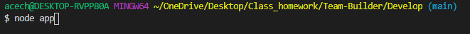
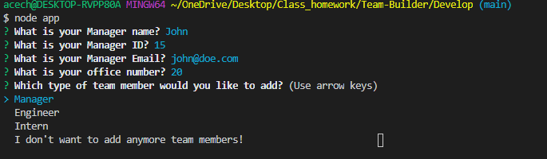
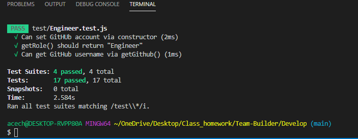
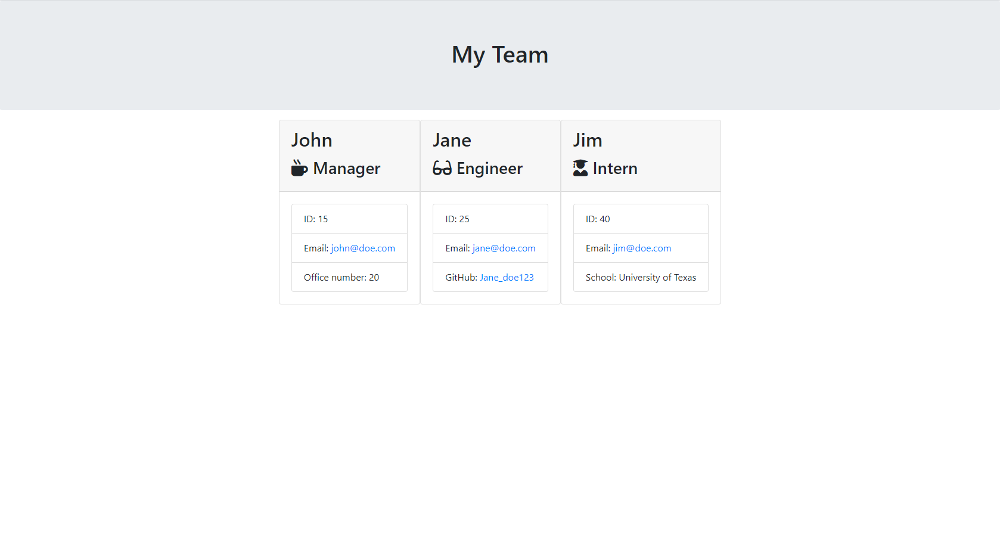

# Team-Builder

## Description

This project is to help create teams of Manager's, engineer's, and Interns's based on the how the questions prompted are answered.

## Usage

## Installation

To use this generator first install Inquirer using "npm i inquirer" as well as node in the develop folder if you have not already.

## GitHub Info

 - https://github.com/Harrichas
 - https://github.com/Harrichas/Team-Builder

 ## Test

 To run this generator use "node index.js" in the develop folder and answer the question provided.